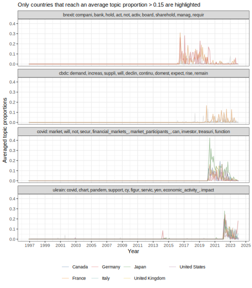
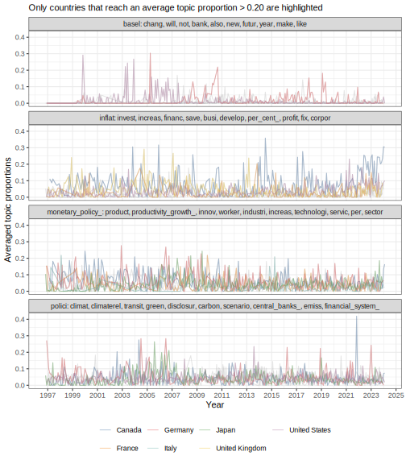

# Explorations with NMF

The non-negative matrix factorization (NMF) files are currently stored under
`inst/NMFregress` ([GitHub](https://github.com/iamdavecampbell/NMFregress)). In its current state,
`NMFregress` requires the user to specify either all or no anchors. There are a few anchors that we
are particularly interested in, and some work needs to be done on `NMFregress` in order to ensure
that users can supply a subset of the anchors, and the remaining anchors are automatically
populated.

For the sake of moving forward with the proof of concept, a 50-topic NMF model is fitted, then a
40-topic NMF model is fitted using our anchors of interest, and the remaining filled in using
anchors from the 50-topic model.

## Initialisation


``` r
library(tidyverse)
library(pins)
library(pinsqs)
library(AzureStor)
library(gghighlight)

source(here::here("R", "azure_init.R"))

fs::dir_ls(here::here("inst", "NMFregress"), glob="*.R") %>%
  walk(source)

theme_set(theme_bw())

speeches_board <- storage_endpoint("https://cbspeeches1.dfs.core.windows.net/", token=token) %>%
  storage_container(name = "cbspeeches") %>%
  board_azure(path = "data-speeches")

models_board <- storage_endpoint("https://cbspeeches1.dfs.core.windows.net/", token=token) %>%
  storage_container(name = "cbspeeches") %>%
  board_azure(path = "data-models")
```

## Model fitting

### Fitting the 50-topic model

The following code was used to fit a 50-topic NMF model. 


``` r
speeches <- speeches_board %>%
  pin_qread("speeches-g7-tdm")

nmf_input <- create_input(speeches, vocab=rownames(speeches), topics=50)
nmf_output <- solve_nmf(nmf_input)
```

The anchors can be found by calling `nmf_output$anchors`.

### Fitting the 40-topic model

A 40-topic NMF model was fitted using a combination of our anchors of interest and the anchors
found from the 50-topic NMF model in the previous step. Note that since the text in the
term-document matrix was lowercased and stemmed, supplied anchors also needed to be in their
lowercased and stemmed form. 

::: {.rmdnote}

The stemmed form of a word can be obtained by calling `SnowballC::wordstem("word")`.

:::


``` r
anchors_of_interest <- c("basel", "cbdc", "ukrain", "covid", "brexit")
autofilled_anchors <- c(
  "inflat", "rate", "euro", "climat", "payment", "trade", "global", "model", "monetary_policy_",
  "economi", "loan", "target", "market", "fund", "chang", "polici", "growth", "data", "percent",
  "invest", "liquid", "consum", "system", "compani", "demand", "risk", "effect", "product",
  "asset", "price", "firm", "pai", "account", "household", "insur"
)
custom_anchors <- c(anchors_of_interest, autofilled_anchors)
```

Fitting the 40-topic NMF model:


``` r
nmf_input <- create_input(speeches, vocab=rownames(speeches), topics=40)
nmf_output <- solve_nmf(nmf_input, user_anchors=custom_anchors)
```

Creating a checkpoint:


``` r
models_board %>%
  pin_qsave(
    nmf_output,
    "nmf-g7-k=40",
    title = "40-topic nmf, g7, custom topics"
  )
```

## Explorations

Loading the required data:


``` r
speeches_metadata <- speeches_board %>%
  pin_qread("speeches-g7-metadata", version="20241207T163741Z-5783f")
```

### Pre-exploration data wrangling

::: {.rmdnote}

Variables that refer to `theta` pertain to the document-topic matrix.

:::

First, document-topic proportions were recovered from the NMF model.


``` r
normalised_theta <- nmf_output %>%
  pluck("theta") %>%
  t() %>%
  magrittr::divide_by(rowSums(.)) %>%
  as_tibble(rownames = "doc") %>%
  pivot_longer(-doc, names_to="anchor", values_to="proportion")
```

Next, document-topic proportions were reunited with speech metadata. The document-topic proportions
were then aggregated and averaged by year-month to produce a monthly time series of topic
proportions.


``` r
doc_dates <- speeches_metadata %>%
  select(doc, country, date)

theta_dates <- inner_join(normalised_theta, doc_dates, by="doc")

summarised_theta_by_month <- theta_dates %>%
  mutate(
    year = year(date),
    month = month(date)
  ) %>%
  group_by(country, year, month, anchor) %>%
  summarise(avg_proportion = mean(proportion)) %>%
  ungroup() %>%
  unite("date", year, month, sep="-") %>%
  mutate(date = ym(date))
```

For plotting, rather than labelling a topic by its anchor word, a topic's top 10 words can be used
instead.


``` r
top_words <- print_top_words(nmf_output, n=10) %>%
  map(str_flatten_comma)

label_top_words <- top_words %>%
  flatten_chr() %>%
  str_c(nmf_output$anchors, ": ", .) %>%
  set_names(nmf_output$anchors) %>%
  as_labeller()
```

### Plots


``` r
summarised_theta_by_month %>%
  filter(anchor %in% c("brexit", "cbdc", "covid", "ukrain")) %>%
  ggplot() +
  geom_line(aes(x=date, y=avg_proportion, colour=country), alpha=0.4) +
  facet_wrap(~ anchor, ncol=1, labeller=label_top_words) +
  gghighlight(
    max(avg_proportion, na.rm=TRUE) > 0.15, max_highlight=3L,
    use_direct_label=FALSE, calculate_per_facet=TRUE
  ) +
  scale_x_date(breaks = "2 years", date_labels="%Y") +
  labs(
    x="Year", y="Averaged topic probabilities",
    subtitle="Only countries that reach an average topic proportion > 0.15 are highlighted"
  ) +
  theme(legend.title=element_blank())
```




``` r
summarised_theta_by_month %>%
  filter(anchor %in% c("polici", "basel", "inflat", "monetary_policy_")) %>%
  ggplot() +
  geom_line(aes(x=date, y=avg_proportion, colour=country), alpha=0.4) +
  facet_wrap(~ anchor, ncol=1, labeller=label_top_words) +
  gghighlight(
    max(avg_proportion, na.rm=TRUE) > 0.20, max_highlight=3L,
    use_direct_label=FALSE, calculate_per_facet=TRUE
  ) +
  scale_x_date(breaks = "2 years", date_labels="%Y") +
  labs(
    x="Year", y="Averaged topic probabilities",
    subtitle="Only countries that reach an average topic proportion > 0.20 are highlighted"
  ) +
  theme(legend.title=element_blank())
```


