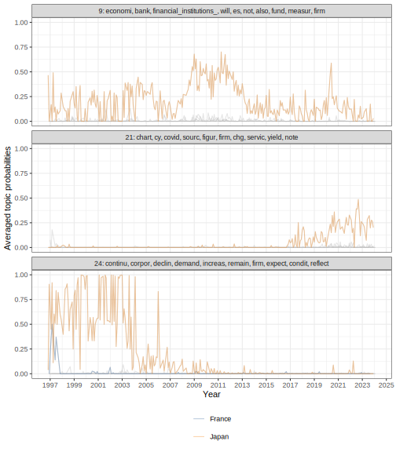

# Explorations with LDA

## Initialisation


``` r
library(tidyverse)
library(tidytext)
library(topicmodels)
library(pins)
library(pinsqs)
library(AzureStor)
library(gghighlight)

source(here::here("R", "azure_init.R"))

fs::dir_ls(here::here("inst", "NMFregress"), glob="*.R") %>%
  walk(source)

theme_set(theme_bw())

speeches_board <- storage_endpoint("https://cbspeeches1.dfs.core.windows.net/", token=token) %>%
  storage_container(name = "cbspeeches") %>%
  board_azure(path = "data-speeches")

models_board <- storage_endpoint("https://cbspeeches1.dfs.core.windows.net/", token=token) %>%
  storage_container(name = "cbspeeches") %>%
  board_azure(path = "data-models")
```

## Model fitting

As a proof of concept, the LDA model will fix the values for the hyperparameters:

- `K`, the number of topics, is set to 40.
- `alpha`, the homogeneity of document-topic distributions, is set to $1/K \,=\, 1/40$.
- `delta`, the homogeneity of topic-term distributions, is set to 0.1.


``` r
speeches <- speeches_board %>%
  pin_qread("speeches-g7-dtm")

gibbs_control <- list(
  seed = 100,
  verbose = 1L,
  alpha = 1/40,
  delta = 0.1,
  iter = 500
)

lda_model <- LDA(
  speeches,
  k = 40,
  method = "Gibbs",
  control = gibbs_control
)
```

Creating a checkpoint:


``` r
models_board %>%
  pin_qsave(
    lda_model,
    "lda-g7-k=40",
    title = "40-topic lda, g7"
  )
```

## Explorations


``` r
speeches_metadata <- speeches_board %>%
  pin_qread("speeches-g7-metadata", version="20241207T163741Z-5783f")
```

### Pre-exploration data wrangling

::: {.rmdnote}

As with NMF, variables that refer to `theta` pertain to the document-topic matrix. Note that LDA
models produced by {topicmodels} refer to this matrix as `gamma`.

:::

As with NMF, the document-topic distribution is first retrieved from the model and reunited with the
document metadata.


``` r
dtd <- lda_output %>%
  tidy(matrix = "gamma") %>%
  inner_join(speeches_metadata, by=c("document" = "doc")) %>%
  arrange(date, document, topic)
```

Next, the document-topic proportions were aggregated and averaged by year-month to produce a monthly
time series of topic proportions.


``` r
summarised_theta_by_month <- dtd %>%
  mutate(
    year = year(date),
    month = month(date)
  ) %>%
  group_by(country, year, month, topic) %>%
  summarise(avg_probability = mean(gamma)) %>%
  ungroup() %>%
  unite("date", year, month, sep="-") %>%
  mutate(date = ym(date))
```

For plotting, rather than labelling a topic by its anchor word, a topic's top 10 words can be used
instead.


``` r
ttd <- lda_output %>%
  tidy(matrix = "beta") %>%
  arrange(topic, desc(beta))

top_words <- ttd %>%
  select(-beta) %>%
  group_split(topic) %>%
  map(~ slice_head(.x, n=10)) %>%
  map(~ pull(.x, term)) %>%
  map(str_flatten_comma) %>%
  set_names(1:40)

label_top_words <- top_words %>%
  flatten_chr() %>%
  str_c(as.character(1:40), ": ", .) %>%
  set_names(1:40) %>%
  as_labeller()
```

### Plots


``` r
summarised_theta_by_month %>%
  filter(topic %in% c(21, 26, 34, 37)) %>%
  ggplot() +
  geom_line(aes(x=date, y=avg_probability, colour=country), alpha=0.4) +
  facet_wrap(~ topic, ncol=1, labeller=label_top_words) +
  gghighlight(max(avg_probability) > 0.4, calculate_per_facet=TRUE, use_direct_label=FALSE) +
  scale_x_date(breaks = "2 years", date_labels="%Y") +
  scale_color_manual(
    values = c("#ff3b30","#ff9500","#ffcc00","#4cd964","#5ac8fa","#007aff","#5856d6"),
    guide = guide_legend(nrow = 2)
  ) +
  labs(
    x="Year", y="Averaged topic probabilities",
    subtitle="Only countries that reach an average topic probability > 0.40 are highlighted"
  ) +
  theme(legend.title=element_blank(), legend.position="bottom")
```


``` r
summarised_theta_by_month %>%
  filter(topic %in% c(9, 21, 24)) %>%
  ggplot() +
  geom_line(aes(x=date, y=avg_probability, colour=country), alpha=0.4) +
  facet_wrap(~ topic, ncol=1, labeller=label_top_words) +
  gghighlight(max(avg_probability) > 0.4, calculate_per_facet=TRUE, use_direct_label=FALSE) +
  scale_x_date(breaks = "2 years", date_labels="%Y") +
  scale_color_manual(
    values = c("#ff3b30","#ff9500","#ffcc00","#4cd964","#5ac8fa","#007aff","#5856d6"),
    guide = guide_legend(nrow = 2)
  ) +
  labs(x="Year", y="Averaged topic probabilities") +
  theme(legend.title=element_blank(), legend.position="bottom")
```




``` r
summarised_theta_by_month %>%
  filter(topic %in% c(14, 8, 31)) %>%
  ggplot() +
  geom_line(aes(x=date, y=avg_probability, colour=country), alpha=0.4) +
  facet_wrap(~ topic, ncol=1, labeller=label_top_words) +
  gghighlight(max(avg_probability) > 0.4, calculate_per_facet=TRUE, use_direct_label=FALSE) +
  scale_x_date(breaks = "2 years", date_labels="%Y") +
  scale_color_manual(
    values = c("#ff3b30","#ff9500","#ffcc00","#4cd964","#5ac8fa","#007aff","#5856d6"),
    guide = guide_legend(nrow = 2)
  ) +
  labs(
    x="Year", y="Averaged topic probabilities",
    subtitle="Only countries that reach an average topic probability > 0.40 are highlighted"
  ) +
  theme(legend.title=element_blank(), legend.position="bottom")
```


